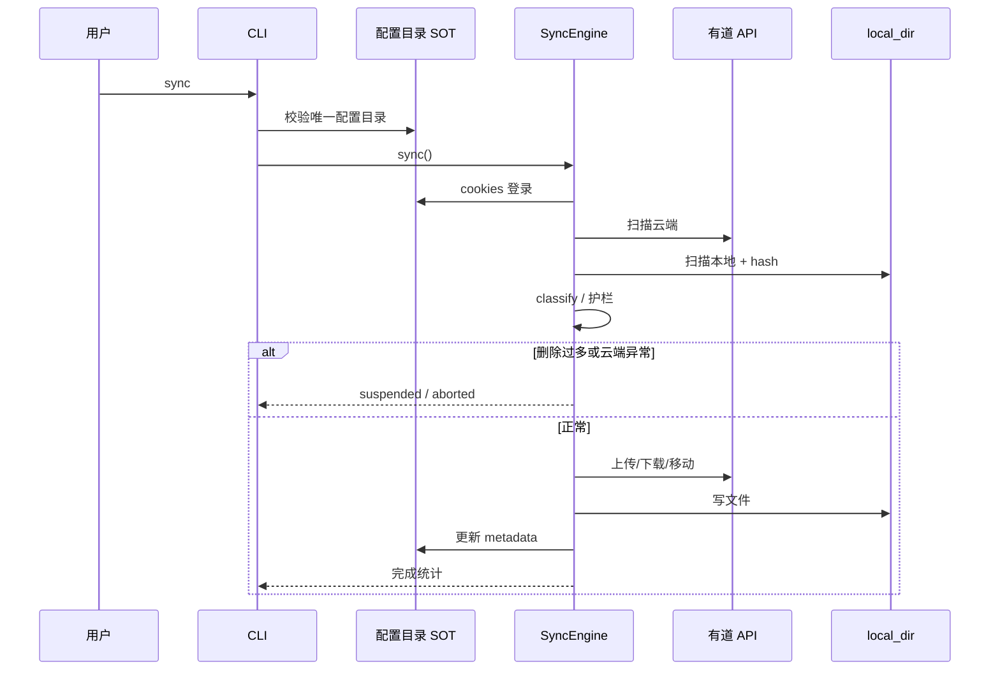
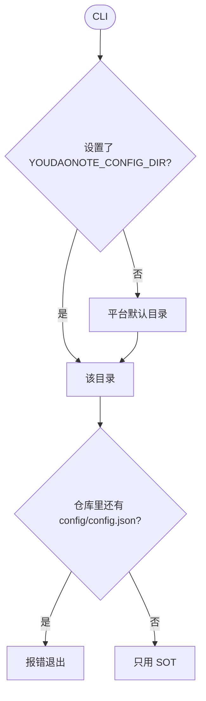

# youdaonote-sync

有道云笔记本地同步工具：把云端笔记同步成 Markdown，支持双向同步、定时监听和 Web 浏览。

- **语言**：[TypeScript](https://www.typescriptlang.org/) / [Node.js](https://nodejs.org/)（需 **18+**，推荐 20+）
- **仓库**：[github.com/h11128/youdaonote-sync](https://github.com/h11128/youdaonote-sync)
- **Issues**：[提交问题](https://github.com/h11128/youdaonote-sync/issues) · [模板](./.github/ISSUE_TEMPLATE/提-issue-请使用这个模版.md)
- **许可**：[MIT](./LICENSE.md)
- **配置指南**：[docs/guides/configuration.md](./docs/guides/configuration.md)
- **有道 API**：[docs/reference/youdao-api.md](./docs/reference/youdao-api.md)
- **架构**：[docs/reference/architecture.md](./docs/reference/architecture.md)
- **文档索引**：[docs/README.md](./docs/README.md)

## 端到端同步流程




详细阶段图见 [Architecture](./docs/reference/architecture.md)。

## 配置：Single source of truth

运行时**只使用一个目录**（完整说明：[配置指南](./docs/guides/configuration.md)）：

| 优先级 | 来源 |
|--------|------|
| 1 | `YOUDAONOTE_CONFIG_DIR`（可选） |
| 2 | Windows `%APPDATA%\youdaonote-sync\` · macOS/Linux `~/.config/youdaonote-sync/` |



| 仓库模板（可提交） | 本机 SOT（不可提交） |
|--------------------|----------------------|
| [`config.example.json`](./config.example.json) | `{SOT}/config.json` |
| [`.env.example`](./.env.example) | 可选 `.env` |
| — | `{SOT}/cookies.json`、`sync_metadata.db` |

```bash
npx youdaonote-sync config path
npx youdaonote-sync config doctor
```

### 安装 → 配置 → 同步

```bash
git clone https://github.com/h11128/youdaonote-sync.git
cd youdaonote-sync/ts-src
npm install && npm run build

npx youdaonote-sync config path
# 复制 ../config.example.json → <SOT>/config.json，填写 local_dir

npx youdaonote-sync login
npx youdaonote-sync sync --dry-run
npx youdaonote-sync sync
```

可选：[Playwright](https://playwright.dev/docs/intro) 扫码登录。

`config.json` 主要字段：`local_dir`（必填）、`maxDeletesPerSync`、`sync_include` / `sync_exclude`、`smms_secret_token`（[SM.MS](https://sm.ms/home/apitoken)）。

常用命令：

```bash
npx youdaonote-sync sync --push|--pull|--git|--propagate-deletes
npx youdaonote-sync watch --interval 300
npx youdaonote-sync gui
npx youdaonote-sync diagnose summary
```

护栏：空云端列表 → abort（exit 3）；删除过多 → suspend（exit 2）。见 [RFC-001](./docs/design/rfc-001-deterministic-guardrails.md)。

## 它能做什么

| 能力 | 说明 |
|------|------|
| 双向同步 | 本地 ↔ 云端互相更新 |
| 单向同步 | `--push` / `--pull` |
| 自动同步 | [`watch`](./ts-src/src/engine/watcher.ts) |
| 格式转换 | [`convert/`](./ts-src/src/convert/) |
| 图片 | 本地或 [SM.MS](https://sm.ms/) |
| 去重 / 移动 | [`dedup/`](./ts-src/src/dedup/) · [`moves.ts`](./ts-src/src/classify/moves.ts) |
| 删除保护 | [RFC-001](./docs/design/rfc-001-deterministic-guardrails.md) |
| Git / GUI / 诊断 | [`util/git.ts`](./ts-src/src/util/git.ts) · [`gui/`](./ts-src/src/gui/) · [`diagnose-cli.ts`](./ts-src/src/cli/diagnose-cli.ts) |

## 同步规则（简版）

- 只有本地有 → 上传；元数据曾同步过则视为云端已删，默认不重建
- 只有云端有 → 下载；元数据曾同步过则视为本地已删，默认不重建
- 内容相同 → 跳过；内容不同 → 尽量单向，否则按较新一侧
- 移动检测：[`moves.ts`](./ts-src/src/classify/moves.ts)；删除传播：`--propagate-deletes`

## NOTE 表格诊断

```bash
npx youdaonote-sync diagnose verify-note --target "folder/note.md"
npx youdaonote-sync diagnose compare-cloud-local --target "folder/note.md"
```

复盘：[2026-03-24-note-table-incident.md](./docs/postmortem/2026-03-24-note-table-incident.md)

## 开发

```bash
cd ts-src && npm test && npm run typecheck && npm run build
```

| 目录 | 职责 |
|------|------|
| [`api/`](./ts-src/src/api/) | API / 登录 |
| [`scan/`](./ts-src/src/scan/) | 扫描 |
| [`classify/`](./ts-src/src/classify/) | 决策 |
| [`engine/`](./ts-src/src/engine/) | 编排 |
| [`execute/`](./ts-src/src/execute/) | 执行 |
| [`convert/`](./ts-src/src/convert/) | 转换 |
| [`metadata/`](./ts-src/src/metadata/) | SQLite |
| [`cli/`](./ts-src/src/cli/) | CLI |

更多图与模块说明：[docs/reference/architecture.md](./docs/reference/architecture.md)

## License

[MIT](./LICENSE.md)
