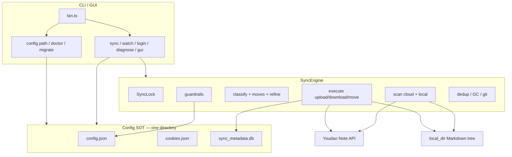
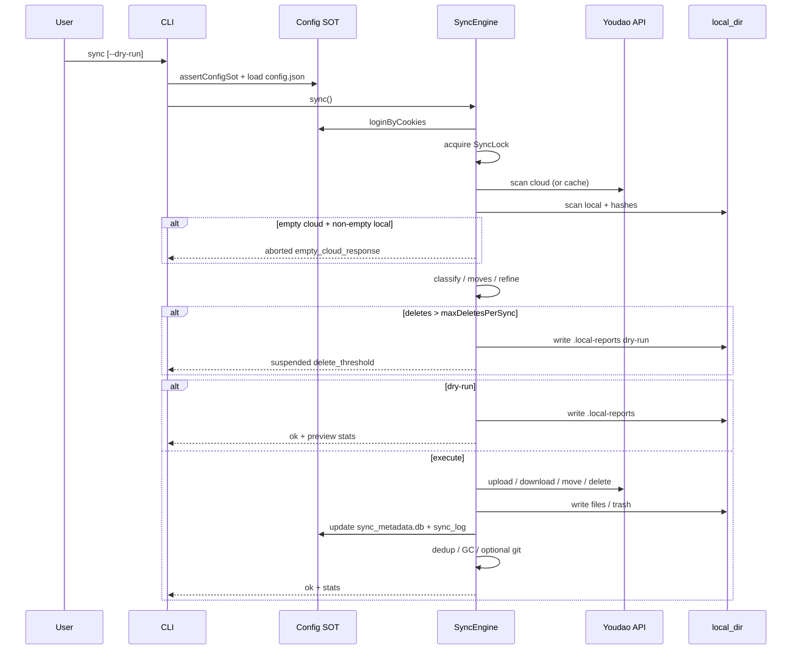
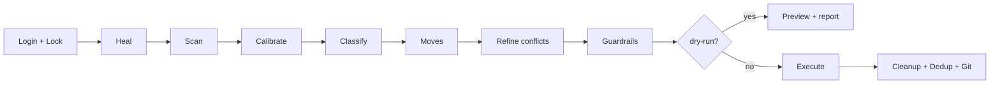
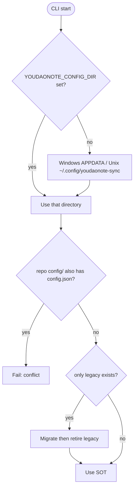

# Architecture

Current runtime architecture for youdaonote-sync (TypeScript).  
User setup: [Configuration guide](../guides/configuration.md) · [README](../../README.md).

## Component overview

## End-to-end sync sequence

## Pipeline stages (happy path)

## Config SOT resolution

## Key modules

| Area | Path |
|------|------|
| Config SOT | [`ts-src/src/util/config-dir.ts`](../../ts-src/src/util/config-dir.ts) |
| CLI | [`ts-src/src/cli/cli.ts`](../../ts-src/src/cli/cli.ts) |
| Engine | [`ts-src/src/engine/engine.ts`](../../ts-src/src/engine/engine.ts) |
| Classify | [`ts-src/src/classify/`](../../ts-src/src/classify/) |
| Execute | [`ts-src/src/execute/`](../../ts-src/src/execute/) |
| Guardrails RFC | [`RFC-001`](../rfc/RFC-001-deterministic-guardrails.md) |

Historical design notes (may be stale): [`archive/design/typescript-rewrite-design.md`](../archive/design/typescript-rewrite-design.md) · [`archive/`](../archive/).
