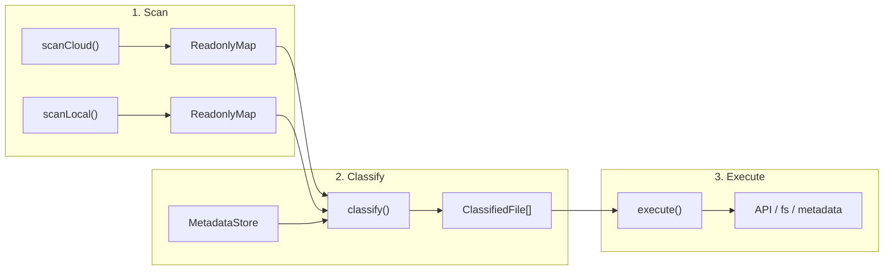

# TypeScript 重写：设计与实现方案

> **Historical (2026-03).** For current usage see the root [README](../../README.md); docs index at [docs/README.md](../README.md).  
> Prior analysis: [rfc-005-sync-engine-overhaul.md](./rfc-005-sync-engine-overhaul.md)  
> SOLID / Dev Practice audit: [2026-03-02-solid-and-dev-practice-audit-ts.md](../archive/postmortem/2026-03-02-solid-and-dev-practice-audit-ts.md)

**TL;DR** — 三阶段管线（Scan → Classify → Execute）设计，classify 是纯函数 + 18 条决策表规则。核心活内容（FileState、Decision Table、Refine 规则、Move 检测）已提取到 [architecture.md](../reference/architecture.md)。本文保留完整类型系统、接口定义和实现细节作历史参考。

本文档保留作架构参考，其中「可交替运行 Python/TS」「tsup 打包」等表述已过时：当前入口为 `ts-src` + `tsc` 构建。

## 一、架构

### 1.1 三阶段管线



- **Scan**：只读快照，输出 `ReadonlyMap<path, CloudFile>` / `ReadonlyMap<path, LocalFile>`。
- **Classify**：纯函数，零副作用。输入快照 + metadata → 输出 `FileState[]`。
- **Execute**：唯一有 I/O 的阶段。

### 1.2 关键设计决定

| 决定 | 理由 |
|------|------|
| classify 是纯函数 | 可 100% 单元测试覆盖，AI 修改时不需要理解 I/O 上下文 |
| 决策逻辑用 Decision Table（数据）而非 if/else（代码） | 改一条规则 = 改数组一行，自动验证完备性 |
| content hash 作为核心决策驱动 | 消除 ghost update（mtime 变但内容没变）和重命名丢失（path 变但 hash 没变） |
| 沿用现有 SQLite schema | 重写期间可交替运行 Python/TS，无需数据迁移 |

## 二、类型系统

### 2.1 Branded Types

```typescript
type FileId = string & { readonly __brand: 'FileId' };
type DirId = string & { readonly __brand: 'DirId' };
type ContentHash = string & { readonly __brand: 'ContentHash' };

enum NoteDomain { NOTE = 0, MARKDOWN = 1 }
```

防止 `FileId` 和 `DirId` 混用——TypeScript 编译器直接报错。

### 2.2 FileState

```typescript
type FileState =
  | { readonly kind: 'synced' }
  | { readonly kind: 'localNew' }
  | { readonly kind: 'cloudNew' }
  | { readonly kind: 'localDeleted' }
  | { readonly kind: 'localDeletedCloudModified' }
  | { readonly kind: 'cloudDeleted' }
  | { readonly kind: 'cloudDeletedLocalModified' }
  | { readonly kind: 'localModified' }
  | { readonly kind: 'cloudModifiedContent' }
  | { readonly kind: 'cloudModifiedMtimeOnly' }
  | { readonly kind: 'bothModifiedConverged' }
  | { readonly kind: 'conflict' }
  | { readonly kind: 'moved'; readonly oldPath: string }
  | { readonly kind: 'gone' }
```

14 个状态。每个 kind 映射唯一 action：

```typescript
type SyncAction = 'skip' | 'upload' | 'download' | 'conflict' | 'move';

function stateToAction(state: FileState): SyncAction {
  switch (state.kind) {
    case 'synced':
    case 'cloudModifiedMtimeOnly':
    case 'bothModifiedConverged':
    case 'localDeleted':
    case 'cloudDeleted':
    case 'gone':
      return 'skip';
    case 'localNew':
    case 'localModified':
    case 'cloudDeletedLocalModified':
      return 'upload';
    case 'cloudNew':
    case 'cloudModifiedContent':
    case 'localDeletedCloudModified':
      return 'download';
    case 'conflict':
      return 'conflict';
    case 'moved':
      return 'move';
    default: {
      const _: never = state;
      throw new Error(`Unhandled: ${JSON.stringify(_)}`);
    }
  }
}
```

新增 FileState 但忘记在 switch 里处理 → 编译报错（`never` 检查）。

### 2.3 数据接口

```typescript
interface CloudFile {
  readonly id: FileId;
  readonly parentId: DirId;
  readonly name: string;
  readonly isDir: boolean;
  readonly mtime: number;  // modifyTimeForSort (ms)
  readonly ctime: number;
  readonly domain: NoteDomain;
}

interface LocalFile {
  readonly path: string;   // absolute path
  readonly isDir: boolean;
  readonly mtime: number;  // seconds
  readonly size?: number;
}

interface MetadataRecord {
  readonly fileId: FileId;
  readonly cloudMtime: number;
  readonly localMtime: number;
  readonly contentHash: ContentHash | null;
  readonly cloudContentHash: ContentHash | null;
  readonly parentId: DirId | null;
  readonly domain: NoteDomain;
  readonly lastSyncAt: number;
  readonly originalDomain: NoteDomain | null;
}
```

所有字段 `readonly`，所有可空字段显式 `| null`。

## 三、Decision Table

### 3.1 条件提取

从原始输入计算布尔条件，每个条件是独立纯函数：

```typescript
interface ClassifyInput {
  readonly local: LocalFile | null;
  readonly cloud: CloudFile | null;
  readonly meta: MetadataRecord | null;
  readonly localHash: ContentHash | null;
}

interface Conditions {
  readonly localExists: boolean;
  readonly cloudExists: boolean;
  readonly previouslySynced: boolean;
  readonly localHashChanged: boolean | null;     // null = 缺 hash 无法判断
  readonly cloudMtimeChanged: boolean | null;     // null = 无 metadata
  readonly localMtimeChanged: boolean | null;     // null = 无 metadata
}

function extractConditions(input: ClassifyInput): Conditions {
  const { local, cloud, meta, localHash } = input;
  return {
    localExists:      local !== null,
    cloudExists:      cloud !== null,
    previouslySynced: meta !== null && meta.lastSyncAt > 0,
    localHashChanged: (localHash && meta?.contentHash)
                        ? localHash !== meta.contentHash : null,
    cloudMtimeChanged: (cloud && meta)
                        ? cloud.mtime !== meta.cloudMtime : null,
    localMtimeChanged: (local && meta && meta.localMtime > 0)
                        ? local.mtime > meta.localMtime : null,
  };
}
```

6 个条件，每个值是 `boolean | null`（null 表示信息不足无法判断）。

### 3.2 规则表

每行一条规则。`undefined` 字段表示"不关心"：

```typescript
interface Rule {
  readonly when: Partial<Conditions>;
  readonly then: FileState['kind'];
}

const RULES: readonly Rule[] = [
  // --- 两端都不存在（理论上不应出现，兜底）---
  { when: { localExists: false, cloudExists: false },
    then: 'gone' },

  // --- 只有本地（云端不存在）---
  { when: { localExists: true, cloudExists: false, previouslySynced: false },
    then: 'localNew' },
  { when: { localExists: true, cloudExists: false, previouslySynced: true, localMtimeChanged: true },
    then: 'cloudDeletedLocalModified' },
  { when: { localExists: true, cloudExists: false, previouslySynced: true, localMtimeChanged: false },
    then: 'cloudDeleted' },
  { when: { localExists: true, cloudExists: false, previouslySynced: true, localMtimeChanged: null },
    then: 'cloudDeleted' },

  // --- 只有云端（本地不存在）---
  { when: { localExists: false, cloudExists: true, previouslySynced: false },
    then: 'cloudNew' },
  { when: { localExists: false, cloudExists: true, previouslySynced: true, cloudMtimeChanged: true },
    then: 'localDeletedCloudModified' },
  { when: { localExists: false, cloudExists: true, previouslySynced: true, cloudMtimeChanged: false },
    then: 'localDeleted' },
  { when: { localExists: false, cloudExists: true, previouslySynced: true, cloudMtimeChanged: null },
    then: 'localDeleted' },

  // --- 两端都存在，有 hash 可比 ---
  { when: { localExists: true, cloudExists: true, localHashChanged: false, cloudMtimeChanged: false },
    then: 'synced' },
  { when: { localExists: true, cloudExists: true, localHashChanged: false, cloudMtimeChanged: true },
    then: 'cloudModifiedContent' },
  { when: { localExists: true, cloudExists: true, localHashChanged: true, cloudMtimeChanged: false },
    then: 'localModified' },
  { when: { localExists: true, cloudExists: true, localHashChanged: true, cloudMtimeChanged: true },
    then: 'conflict' },

  // --- 两端都存在，有 hash 但无 cloud mtime（防御：实际不应出现）---
  { when: { localExists: true, cloudExists: true, localHashChanged: false, cloudMtimeChanged: null },
    then: 'synced' },
  { when: { localExists: true, cloudExists: true, localHashChanged: true, cloudMtimeChanged: null },
    then: 'localModified' },

  // --- 两端都存在，无 hash（首次 / 回退）---
  { when: { localExists: true, cloudExists: true, localHashChanged: null, cloudMtimeChanged: false },
    then: 'synced' },
  { when: { localExists: true, cloudExists: true, localHashChanged: null, cloudMtimeChanged: true },
    then: 'cloudModifiedContent' },
  { when: { localExists: true, cloudExists: true, localHashChanged: null, cloudMtimeChanged: null },
    then: 'synced' },
];
```

18 条规则，覆盖所有输入组合（含 2 条防御规则，应对实际不会出现但测试会枚举到的条件组合）。

**状态名称约定**：`localDeleted` = 本地删了该文件（本地不存在、云端存在、同步过）；`cloudDeleted` = 云端删了该文件（云端不存在、本地存在、同步过）。名称描述的是"谁做了删除动作"，不是"谁还存在"。

### 3.3 匹配引擎

```typescript
function classify(input: ClassifyInput): FileState {
  const cond = extractConditions(input);
  for (const rule of RULES) {
    if (matchesRule(cond, rule.when)) {
      return { kind: rule.then } as FileState;
    }
  }
  throw new Error(`No rule matched: ${JSON.stringify(cond)}`);
}

function matchesRule(cond: Conditions, when: Partial<Conditions>): boolean {
  for (const [key, expected] of Object.entries(when)) {
    if (expected === undefined) continue;
    if (cond[key as keyof Conditions] !== expected) return false;
  }
  return true;
}
```

引擎本身 ~10 行，几乎不需要改动。所有决策逻辑在规则表数据里。

### 3.4 Refine 阶段

初始分类中 `cloudModifiedContent` 需要二轮细分（下载云端内容算 hash 后）：

```typescript
interface RefineConditions {
  readonly cloudHashEqualLocal: boolean;
  readonly localHashChanged: boolean;
  readonly cloudHashEqualMeta: boolean;
}

const REFINE_RULES: readonly { when: Partial<RefineConditions>; then: FileState['kind'] }[] = [
  { when: { cloudHashEqualLocal: true,  localHashChanged: false },
    then: 'cloudModifiedMtimeOnly' },
  { when: { cloudHashEqualLocal: true,  localHashChanged: true },
    then: 'bothModifiedConverged' },
  { when: { cloudHashEqualLocal: false, cloudHashEqualMeta: true },
    then: 'localModified' },
  { when: { cloudHashEqualLocal: false, cloudHashEqualMeta: false },
    then: 'conflict' },
];
```

同样是决策表，同样自动验证完备性。

### 3.5 Move 检测

在 classify 之后、execute 之前运行：

```typescript
function detectMoves(
  classified: ReadonlyMap<string, { state: FileState; hash: ContentHash | null }>,
): Map<string, FileState> {
  // 1. 建 hash → path[] 索引
  // 2. 找所有 cloudDeleted(本地有) + cloudNew(本地没有) 且 hash 相同的配对
  //    → 替换为 { kind: 'moved', oldPath }
  // 3. 找所有 localDeleted(云端有) + localNew(云端没有) 且 hash 相同的配对
  //    → 替换为 { kind: 'moved', oldPath }
  // 纯 hash 匹配，不依赖文件名
}
```

### 3.6 自动验证

```typescript
import { test } from '@fast-check/vitest';
import { fc } from '@fast-check/vitest';

const tri = fc.option(fc.boolean(), { nil: null });

test.prop([fc.boolean(), fc.boolean(), fc.boolean(), tri, tri, tri])(
  '任意条件组合命中恰好一条规则',
  (le, ce, ps, lhc, cmc, lmc) => {
    const cond: Conditions = {
      localExists: le, cloudExists: ce, previouslySynced: ps,
      localHashChanged: lhc, cloudMtimeChanged: cmc, localMtimeChanged: lmc,
    };
    expect(RULES.filter(r => matchesRule(cond, r.when))).toHaveLength(1);
  },
);
```

## 四、当前 Bug → 新状态映射

| Bug | 当前根因 | 新状态 | 新 Action |
|-----|---------|--------|-----------|
| Ghost update（mtime 变了内容没变） | `decide_action` 只看 mtime | classify → `cloudModifiedContent` → refine → `cloudModifiedMtimeOnly` | SKIP |
| 重命名丢失（文件名改太多） | `reconcile_moves` 依赖文件名相似度 | `detectMoves` 用 hash 索引匹配 | MOVE |
| 孤儿目录（已删目录被 DOWNLOAD） | 目录无 `previouslySynced` 逻辑 | 目录也走 classify → `localDeleted` | SKIP |
| 云端删了但本地又改了 | `decide_action` 直接 SKIP | `cloudDeletedLocalModified` | UPLOAD |
| 本地删了但云端又改了 | `decide_action` 直接 SKIP | `localDeletedCloudModified` | DOWNLOAD |

## 五、模块结构

```
ts-src/src/
├── types/
│   ├── common.ts           # branded types: FileId, DirId, RelPath, EpochSeconds, NoteDomain
│   ├── state.ts            # FileState (discriminated union), SyncAction, stateToAction()
│   ├── scan.ts             # CloudFile, LocalFile
│   ├── metadata.ts         # MetadataRecord
│   └── engine-config.ts    # SyncEngineConfig
├── api/
│   ├── client.ts           # YoudaoNoteApi (fetch)
│   ├── cookies.ts          # Cookie 管理
│   ├── auth.ts             # 登录流程（Playwright 扫码）
│   ├── dir.ts              # 目录操作 API
│   ├── file-api.ts         # 文件操作 API
│   ├── request.ts          # HTTP 请求封装
│   ├── retry.ts            # retryWithBackoff()
│   └── constants.ts        # API URL 常量
├── scan/
│   ├── cloud.ts            # scanCloud(): BFS + 并发 fetch
│   ├── cloud-cache.ts      # 缓存云端扫描结果，增量更新
│   ├── local.ts            # scanLocal(): recursive readdir
│   └── name.ts             # sanitizeFilename(), mapCloudName()
├── classify/
│   ├── rules.ts            # RULES, REFINE_RULES
│   ├── conditions.ts       # 规则条件函数
│   ├── classify.ts         # classify(), matchesRule()
│   ├── calibrate.ts        # 分类校准（hash 比较精细化）
│   ├── refine.ts           # refineCloudModified()
│   ├── moves.ts            # detectMoves()
│   └── cross-dir-match.ts  # 跨目录移动检测
├── engine/
│   ├── engine.ts           # SyncEngine: scan → classify → execute
│   ├── execute.ts          # runExecuteSync(): 桥接 engine 和 executor
│   ├── helpers.ts          # dry-run 诊断、预览输出
│   ├── helpers-dryrun.ts   # Markdown 报告生成
│   ├── refine.ts           # engine 级 refine 逻辑
│   └── watcher.ts          # --watch 轮询模式
├── execute/
│   ├── types.ts            # SyncStats, ExecuteContext, emptyStats()
│   ├── executor.ts         # executeAll(): 并发调度
│   ├── download.ts         # downloadFile(), handleDownload()
│   ├── upload.ts           # uploadFile(), ensureParentDir()
│   ├── move-handler.ts     # handleMove(), fallbackDeleteOldFiles()
│   ├── conflict.ts         # conflictFallback(): 备份+下载
│   ├── diff3-merge.ts      # tryDiff3Merge(): 三路合并
│   ├── images.ts           # 图片 URL 迁移
│   └── image-upload.ts     # SM.MS 图床上传
├── convert/
│   ├── xml-to-md.ts        # Youdao XML → Markdown
│   ├── json-to-md.ts       # Youdao JSON → Markdown
│   ├── html-to-md.ts       # HTML → Markdown
│   └── md-to-note.ts       # Markdown → Youdao JSON
├── metadata/
│   ├── store.ts            # MetadataStore (better-sqlite3)
│   ├── store-files.ts      # 文件记录 CRUD
│   ├── store-dirs.ts       # 目录记录 CRUD
│   ├── store-hash-cache.ts # 内容 hash 缓存
│   ├── store-file-base.ts  # 基准内容存储（diff3 用）
│   ├── store-state.ts      # 同步状态管理
│   ├── store-state-kv.ts   # 键值对状态存储
│   ├── store-sync-log.ts   # 同步日志
│   ├── desktop-data.ts     # 从桌面客户端导入种子数据
│   ├── migrations.ts       # schema 迁移
│   └── health.ts           # 元数据自愈
├── algo/
│   ├── hash.ts             # computeContentHash(): 标准化 + XXH3-128
│   ├── xxhash.ts           # xxhash-wasm 封装
│   ├── bloom.ts            # Bloom Filter（重复检测）
│   ├── merkle.ts           # Merkle Tree（目录变化检测）
│   ├── block-hash.ts       # 分块 hash（大文件比较）
│   ├── merge.ts            # threeWayMerge(): 文本三路合并
│   └── edit-index.ts       # 编辑距离索引
├── dedup/
│   ├── walk.ts             # 遍历重复候选
│   ├── orphan.ts           # 孤立文件检测
│   ├── resolve.ts          # 去重决策
│   ├── execute.ts          # 去重执行（删除）
│   ├── refs.ts             # 引用关系
│   ├── hash-index.ts       # hash 索引
│   └── compat.ts           # Python hash 兼容
├── browse/
│   ├── search.ts           # 云端搜索
│   └── pull.ts             # 单次拉取（非同步）
├── gui/
│   ├── server.ts           # HTTP GUI 服务器
│   └── ui.ts               # 前端 HTML 生成
├── cli/
│   ├── cli.ts              # commander CLI 入口
│   └── browse.ts           # browse 子命令
├── tools/
│   ├── diagnose.ts         # diagnose 诊断命令
│   ├── diagnose-commands.ts # 诊断子命令实现
│   └── profile-command.ts  # 性能 profiling 命令
├── perf/
│   ├── analyzer.ts         # 性能分析器
│   └── profiler.ts         # 性能数据采集
├── util/
│   ├── utils.ts            # readFileMtime(), formatFileSize()
│   ├── path.ts             # 路径处理工具
│   ├── preconditions.ts    # requireNonEmpty() 等前置条件检查
│   ├── concurrency.ts      # pLimit(): 并发限流
│   ├── lock.ts             # 文件锁（防并发同步）
│   ├── git.ts              # Git 自动提交
│   └── config-dir.ts       # 配置目录解析
└── index.ts
```

### 5.1 Python 模块处置清单

| Python 模块 | 处置 | TypeScript 对应 |
|-------------|------|----------------|
| `sync/types.py` | 重写 | `types/*.ts` — branded types + discriminated union |
| `sync/utils.py` (decide_action) | 重写 | `classify/rules.ts` — Decision Table |
| `sync/utils.py` (sanitize 等) | 重写 | `scan/name.ts`, `execute/` |
| `sync/decision.py` (calibrate) | 吸收 | `classify/calibrate.ts` |
| `sync/moves.py` | 重写 | `classify/moves.ts` — 纯 hash 匹配 |
| `sync/scanner.py` | 重写 | `scan/cloud.ts` + `scan/local.ts` |
| `sync/metadata.py` | 重写 | `metadata/store.ts` |
| `sync/metadata_aux.py` | 合并 | 并入 `metadata/store.ts` |
| `sync/metadata_migrations.py` | 重写 | `metadata/migrations.ts` |
| `sync/metadata_health.py` | 重写 | `metadata/health.ts` |
| `sync/engine.py` | 重写 | `engine/engine.ts` — 20 步 → 3 步 |
| `sync/merge.py` | 重写 | `execute/conflict.ts` |
| `sync/dedup.py` | 重写 | `dedup/` — 模块化拆分 |
| `sync/git_helper.py` | 重写 | `util/git.ts` |
| `sync/desktop_data.py` | 重写 | `metadata/desktop-data.ts` |
| `sync/bloom.py`, `rolling_hash.py` | 重写 | `algo/bloom.ts`, `algo/block-hash.ts` |
| `sync/merkle.py` | 重写 | `algo/merkle.ts` |
| `api.py` | 重写 | `api/client.ts` |
| `cookies.py` | 重写 | `api/cookies.ts` |
| `auth.py`, `login.py` | 重写 | `api/auth.ts` |
| `convert/*.py` | 重写 | `convert/*.ts` |
| `transfer/download.py` | 重写 | `execute/download.ts` |
| `transfer/upload.py` | 重写 | `execute/upload.ts` |
| `transfer/image.py`, `image_upload.py` | 重写 | `execute/images.ts`, `execute/image-upload.ts` |
| `transfer/search.py`, `pull.py` | 重写 | `browse/search.ts`, `browse/pull.ts` |
| `watcher.py` | 重写 | `engine/watcher.ts` |
| `gui/` | 重写 | `gui/server.ts`, `gui/ui.ts` — HTTP GUI 服务器 |
| `protocols.py` | 丢弃 | TypeScript interface 原生替代 |
| `common.py` | 重写 | `types/common.ts` |
| `cli.py`, `__main__.py` | 重写 | `cli/cli.ts` + `index.ts` |

## 六、依赖

```json
{
  "dependencies": {
    "better-sqlite3": "^11.0.0",
    "commander": "^12.0.0",
    "fast-xml-parser": "^4.0.0",
    "xxhash-wasm": "^1.0.0",
    "xxh3-ts": "^2.0.1"
  },
  "devDependencies": {
    "typescript": "^5.0.0",
    "typescript-eslint": "^8.56.1",
    "vitest": "^2.0.0",
    "@vitest/coverage-v8": "^2.1.9",
    "@fast-check/vitest": "^0.1.0",
    "@types/better-sqlite3": "^7.0.0",
    "@types/node": "^22.0.0",
    "tsup": "^8.0.0",
    "eslint": "^10.0.2",
    "eslint-plugin-import-x": "^4.16.2",
    "eslint-plugin-sonarjs": "^4.0.0",
    "eslint-config-prettier": "^10.1.8",
    "prettier": "^3.8.1"
  }
}
```

HTTP 用 Node.js 内置 `fetch`（Node 18+）。浏览器自动登录可选安装 `playwright`。

## 七、实施阶段

### Phase 1: 脚手架 + 类型 ✅

- `package.json` + `tsconfig.json` (strict: true, noUncheckedIndexedAccess: true)
- vitest + fast-check 配置
- `types/` 全部类型定义
- 编译验证通过

### Phase 2: Decision Table + 测试 ✅

- `classify/conditions.ts` + `classify/rules.ts` + `classify/classify.ts`
- `classify/refine.ts` + `classify/moves.ts` + `classify/calibrate.ts` + `classify/cross-dir-match.ts`
- 每个 FileState 至少一个测试用例（14 状态 = 14+ 测试）
- fast-check 完备性验证

### Phase 3: Metadata + Scanner ✅

- `metadata/store.ts` — better-sqlite3 封装，拆分为 store-files/store-dirs/store-hash-cache 等子模块
- `metadata/migrations.ts` — schema 迁移
- `scan/cloud.ts` + `scan/cloud-cache.ts` + `scan/local.ts` + `scan/name.ts`

### Phase 4: API + Transfer + Convert ✅

- `api/client.ts` + `api/cookies.ts` + `api/auth.ts` + `api/dir.ts` + `api/file-api.ts`
- `execute/download.ts` + `execute/upload.ts` + `execute/images.ts` + `execute/move-handler.ts`
- `convert/xml-to-md.ts` + `convert/json-to-md.ts` + `convert/html-to-md.ts` + `convert/md-to-note.ts`

### Phase 5: Engine + CLI ✅

- `engine/engine.ts` — scan → classify → refine → detectMoves → execute
- `engine/watcher.ts` + `util/git.ts` + `dedup/`
- `cli/cli.ts` — sync, pull, login, list, search, download, browse, diagnose, gui
- 端到端测试 + dry-run 验证

### Phase 6: 验证 + 切换 ✅

- Python dry-run vs TypeScript dry-run 输出对比
- 真实数据同步验证
- Python 代码归档，TS 成为主线
- 额外完成：algo/（Bloom Filter、Merkle Tree、block hash）、browse/、gui/、tools/、perf/ 模块

## 八、风险与缓解

| 风险 | 影响 | 缓解 | 状态 |
|------|------|------|------|
| classify 逻辑移植遗漏 | 高 | TDD + fast-check 完备性验证 | ✅ 已验证 |
| XML/JSON 转换边界格式 | 中 | 移植 Python 测试用例，逐格式验证 | ✅ 已验证 |
| 有道云 API 调试不便 | 中 | `tools/diagnose.ts` 提供 path/decision/summary 诊断 | ✅ 已实现 |
| better-sqlite3 native binding | 低 | prebuild 支持 Windows/macOS/Linux | ✅ 无问题 |
| GUI 缺失 | 低 | `gui/server.ts` + `gui/ui.ts` 已实现 HTTP GUI | ✅ 已实现 |

## 九、代码量（实际）

> 截至 2026-03-15 统计。

| 模块 | 源码行数 |
|------|----------|
| types/ | ~190 |
| api/ | ~1,400 |
| scan/ | ~850 |
| classify/ | ~840 |
| engine/ | ~1,020 |
| execute/ | ~1,210 |
| convert/ | ~740 |
| metadata/ | ~1,660 |
| algo/ | ~1,080 |
| dedup/ | ~890 |
| browse/ | ~320 |
| gui/ | ~390 |
| cli/ | ~460 |
| tools/ | ~750 |
| perf/ | ~250 |
| util/ | ~390 |
| **源码合计** | **~12,450** |
| 测试 | ~9,930 |
| **总计** | **~22,380** |

比最初估算大 3 倍多，主要原因：新增了 `algo/`（Bloom Filter、Merkle Tree、block hash）、`dedup/`（模块化拆分）、`browse/`、`gui/`、`tools/`、`perf/` 等超出原 Python 范围的模块，以及 metadata store 拆分为多个子模块后的体量增长。
