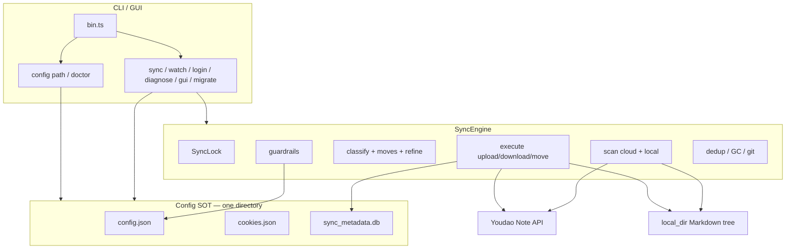
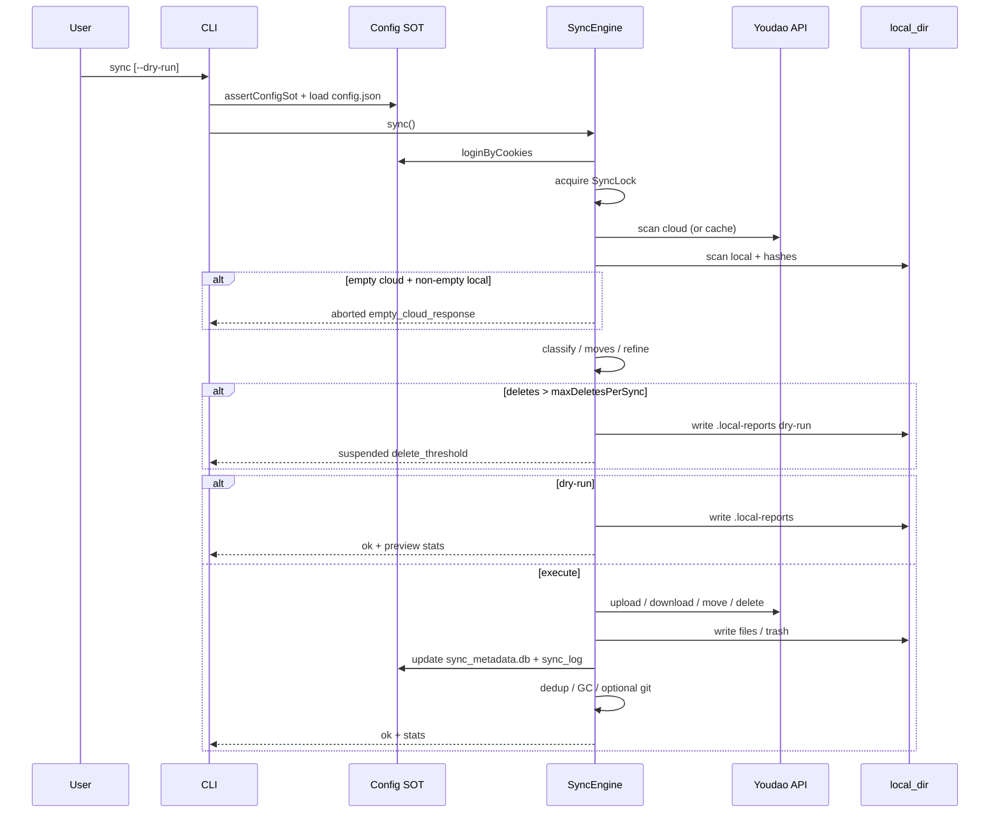
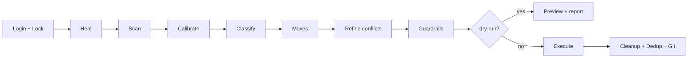
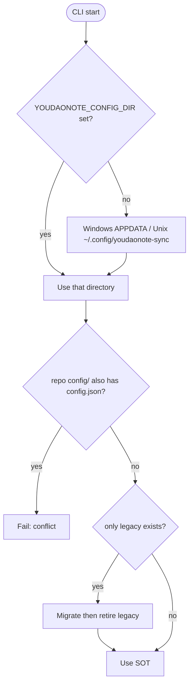

# Architecture

Current runtime architecture for youdaonote-sync (TypeScript).  
User setup: [Configuration guide](../guides/configuration.md) · [README](../../README.md).

## Component overview

## End-to-end sync sequence

## Pipeline stages (happy path)

## Config SOT resolution

## Key modules

| Area | Path |
|------|------|
| Config SOT | [`ts-src/src/util/config-dir.ts`](../../ts-src/src/util/config-dir.ts) |
| CLI | [`ts-src/src/cli/cli.ts`](../../ts-src/src/cli/cli.ts) |
| Engine | [`ts-src/src/engine/engine.ts`](../../ts-src/src/engine/engine.ts) |
| Classify | [`ts-src/src/classify/`](../../ts-src/src/classify/) |
| Execute | [`ts-src/src/execute/`](../../ts-src/src/execute/) |
| Guardrails RFC | [`RFC-007`](../design/rfc-007-deterministic-guardrails.md) |

## Classify logic

The classify stage is a **pure function** (zero I/O). It reads two snapshots + metadata and outputs a `FileState` for each path.

### FileState (14 kinds)

| Kind | Meaning | Action |
|------|---------|--------|
| `synced` | Both sides match | skip |
| `localNew` | File exists locally, never synced | upload |
| `cloudNew` | File exists in cloud, never synced | download |
| `localModified` | Local hash changed, cloud unchanged | upload |
| `cloudModifiedContent` | Cloud mtime changed, local unchanged | download |
| `cloudModifiedMtimeOnly` | Cloud mtime changed but hash identical | skip |
| `bothModifiedConverged` | Both changed but hash converged | skip |
| `conflict` | Both changed, hashes differ | conflict |
| `localDeleted` | Local removed a previously-synced file | skip (or deleteCloud) |
| `cloudDeleted` | Cloud removed a previously-synced file | skip (or deleteLocal) |
| `localDeletedCloudModified` | Local deleted + cloud changed | download |
| `cloudDeletedLocalModified` | Cloud deleted + local changed | upload |
| `moved` | Path changed but hash same | move |
| `gone` | Neither side has it | skip |

### Decision Table (first-match)

Conditions extracted per path:

| Condition | Source |
|-----------|--------|
| `localExists` | local snapshot |
| `cloudExists` | cloud snapshot |
| `previouslySynced` | meta exists with `fileId` and `lastSyncAt > 0` |
| `localHashChanged` | `localHash !== meta.contentHash` (null if no hash) |
| `cloudMtimeChanged` | `cloud.mtime > meta.cloudMtime` when `meta.cloudMtime > 0`; `true` if `meta.cloudMtime === 0`; null if no meta |
| `localMtimeChanged` | `local.mtime > meta.localMtime` when `meta.localMtime > 0`; else true / null |

18 rules cover all input combinations including 2 defensive fallbacks. The engine iterates rules top-down; first match wins. Source: [`conditions.ts`](../../ts-src/src/classify/conditions.ts).

### Three-way hash comparison (Refine stage)

After classify, paths classified as `cloudModifiedContent` or `conflict` download the cloud content hash and re-match against `REFINE_RULES`:

| cloudHash == localHash | localHashChanged | cloudHash == metaHash | Result |
|------------------------|------------------|-----------------------|--------|
| true | false | - | `cloudModifiedMtimeOnly` |
| true | true | - | `bothModifiedConverged` |
| false | false | - | `cloudModifiedContent` |
| false | true | true | `localModified` |
| false | true | false | `conflict` |

Source: [`rules.ts`](../../ts-src/src/classify/rules.ts) `REFINE_RULES`.

### Move detection

Runs after classify, before execute. Four phases ([`moves.ts`](../../ts-src/src/classify/moves.ts)):

1. **fileId** — metadata `fileId` ↔ cloud ID
2. **Same-dir name** — sanitized filenames match in the same directory
3. **Cross-directory (same side)** — content hash + filename among `cloudDeleted`↔`cloudNew` and `localDeleted`↔`localNew`
4. **Cross-side** — `cloudNew`↔`localNew` hash/filename (simultaneous rename on both sides)

Hash source: local disk hash, with metadata `contentHash` as fallback when the local file is gone.

Source: [`ts-src/src/classify/`](../../ts-src/src/classify/) · Design details: [`RFC-006`](../design/rfc-006-typescript-rewrite-design.md)

---

Historical design notes (may be stale): [`RFC-006`](../design/rfc-006-typescript-rewrite-design.md) · [`archive/postmortem/`](../archive/postmortem/).
