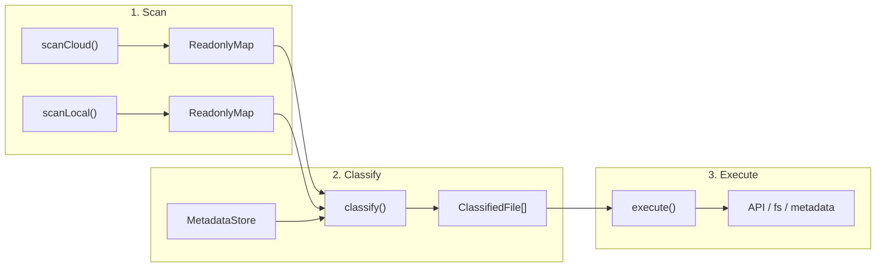

# TypeScript 重写：设计与实现方案

> 2026-03-01 | 前置分析见 [sync-engine-overhaul.md](sync-engine-overhaul.md)
>
> 本文档是实现层面的设计，不再重复"为什么要重写"。TS 代码库 SOLID 与 Dev Practice 审查见 [solid-and-dev-practice-audit-ts.md](solid-and-dev-practice-audit-ts.md)。

## 一、架构

### 1.1 三阶段管线



- **Scan**：只读快照，输出 `ReadonlyMap<path, CloudFile>` / `ReadonlyMap<path, LocalFile>`。
- **Classify**：纯函数，零副作用。输入快照 + metadata → 输出 `FileState[]`。
- **Execute**：唯一有 I/O 的阶段。

### 1.2 关键设计决定

| 决定 | 理由 |
|------|------|
| classify 是纯函数 | 可 100% 单元测试覆盖，AI 修改时不需要理解 I/O 上下文 |
| 决策逻辑用 Decision Table（数据）而非 if/else（代码） | 改一条规则 = 改数组一行，自动验证完备性 |
| content hash 作为核心决策驱动 | 消除 ghost update（mtime 变但内容没变）和重命名丢失（path 变但 hash 没变） |
| 沿用现有 SQLite schema | 重写期间可交替运行 Python/TS，无需数据迁移 |

## 二、类型系统

### 2.1 Branded Types

```typescript
type FileId = string & { readonly __brand: 'FileId' };
type DirId = string & { readonly __brand: 'DirId' };
type ContentHash = string & { readonly __brand: 'ContentHash' };

enum NoteDomain { NOTE = 0, MARKDOWN = 1 }
```

防止 `FileId` 和 `DirId` 混用——TypeScript 编译器直接报错。

### 2.2 FileState

```typescript
type FileState =
  | { readonly kind: 'synced' }
  | { readonly kind: 'localNew' }
  | { readonly kind: 'cloudNew' }
  | { readonly kind: 'localDeleted' }
  | { readonly kind: 'localDeletedCloudModified' }
  | { readonly kind: 'cloudDeleted' }
  | { readonly kind: 'cloudDeletedLocalModified' }
  | { readonly kind: 'localModified' }
  | { readonly kind: 'cloudModifiedContent' }
  | { readonly kind: 'cloudModifiedMtimeOnly' }
  | { readonly kind: 'bothModifiedConverged' }
  | { readonly kind: 'conflict' }
  | { readonly kind: 'moved'; readonly oldPath: string }
  | { readonly kind: 'gone' }
```

14 个状态。每个 kind 映射唯一 action：

```typescript
type SyncAction = 'skip' | 'upload' | 'download' | 'conflict' | 'move';

function stateToAction(state: FileState): SyncAction {
  switch (state.kind) {
    case 'synced':
    case 'cloudModifiedMtimeOnly':
    case 'bothModifiedConverged':
    case 'localDeleted':
    case 'cloudDeleted':
    case 'gone':
      return 'skip';
    case 'localNew':
    case 'localModified':
    case 'cloudDeletedLocalModified':
      return 'upload';
    case 'cloudNew':
    case 'cloudModifiedContent':
    case 'localDeletedCloudModified':
      return 'download';
    case 'conflict':
      return 'conflict';
    case 'moved':
      return 'move';
    default: {
      const _: never = state;
      throw new Error(`Unhandled: ${JSON.stringify(_)}`);
    }
  }
}
```

新增 FileState 但忘记在 switch 里处理 → 编译报错（`never` 检查）。

### 2.3 数据接口

```typescript
interface CloudFile {
  readonly id: FileId;
  readonly parentId: DirId;
  readonly name: string;
  readonly isDir: boolean;
  readonly mtime: number;  // modifyTimeForSort (ms)
  readonly ctime: number;
  readonly domain: NoteDomain;
}

interface LocalFile {
  readonly path: string;   // absolute path
  readonly isDir: boolean;
  readonly mtime: number;  // seconds
  readonly size?: number;
}

interface MetadataRecord {
  readonly fileId: FileId;
  readonly cloudMtime: number;
  readonly localMtime: number;
  readonly contentHash: ContentHash | null;
  readonly cloudContentHash: ContentHash | null;
  readonly parentId: DirId | null;
  readonly domain: NoteDomain;
  readonly lastSyncAt: number;
  readonly originalDomain: NoteDomain | null;
}
```

所有字段 `readonly`，所有可空字段显式 `| null`。

## 三、Decision Table

### 3.1 条件提取

从原始输入计算布尔条件，每个条件是独立纯函数：

```typescript
interface ClassifyInput {
  readonly local: LocalFile | null;
  readonly cloud: CloudFile | null;
  readonly meta: MetadataRecord | null;
  readonly localHash: ContentHash | null;
}

interface Conditions {
  readonly localExists: boolean;
  readonly cloudExists: boolean;
  readonly previouslySynced: boolean;
  readonly localHashChanged: boolean | null;     // null = 缺 hash 无法判断
  readonly cloudMtimeChanged: boolean | null;     // null = 无 metadata
  readonly localMtimeChanged: boolean | null;     // null = 无 metadata
}

function extractConditions(input: ClassifyInput): Conditions {
  const { local, cloud, meta, localHash } = input;
  return {
    localExists:      local !== null,
    cloudExists:      cloud !== null,
    previouslySynced: meta !== null && meta.lastSyncAt > 0,
    localHashChanged: (localHash && meta?.contentHash)
                        ? localHash !== meta.contentHash : null,
    cloudMtimeChanged: (cloud && meta)
                        ? cloud.mtime !== meta.cloudMtime : null,
    localMtimeChanged: (local && meta && meta.localMtime > 0)
                        ? local.mtime > meta.localMtime : null,
  };
}
```

6 个条件，每个值是 `boolean | null`（null 表示信息不足无法判断）。

### 3.2 规则表

每行一条规则。`undefined` 字段表示"不关心"：

```typescript
interface Rule {
  readonly when: Partial<Conditions>;
  readonly then: FileState['kind'];
}

const RULES: readonly Rule[] = [
  // --- 两端都不存在（理论上不应出现，兜底）---
  { when: { localExists: false, cloudExists: false },
    then: 'gone' },

  // --- 只有本地（云端不存在）---
  { when: { localExists: true, cloudExists: false, previouslySynced: false },
    then: 'localNew' },
  { when: { localExists: true, cloudExists: false, previouslySynced: true, localMtimeChanged: true },
    then: 'cloudDeletedLocalModified' },
  { when: { localExists: true, cloudExists: false, previouslySynced: true, localMtimeChanged: false },
    then: 'cloudDeleted' },
  { when: { localExists: true, cloudExists: false, previouslySynced: true, localMtimeChanged: null },
    then: 'cloudDeleted' },

  // --- 只有云端（本地不存在）---
  { when: { localExists: false, cloudExists: true, previouslySynced: false },
    then: 'cloudNew' },
  { when: { localExists: false, cloudExists: true, previouslySynced: true, cloudMtimeChanged: true },
    then: 'localDeletedCloudModified' },
  { when: { localExists: false, cloudExists: true, previouslySynced: true, cloudMtimeChanged: false },
    then: 'localDeleted' },
  { when: { localExists: false, cloudExists: true, previouslySynced: true, cloudMtimeChanged: null },
    then: 'localDeleted' },

  // --- 两端都存在，有 hash 可比 ---
  { when: { localExists: true, cloudExists: true, localHashChanged: false, cloudMtimeChanged: false },
    then: 'synced' },
  { when: { localExists: true, cloudExists: true, localHashChanged: false, cloudMtimeChanged: true },
    then: 'cloudModifiedContent' },
  { when: { localExists: true, cloudExists: true, localHashChanged: true, cloudMtimeChanged: false },
    then: 'localModified' },
  { when: { localExists: true, cloudExists: true, localHashChanged: true, cloudMtimeChanged: true },
    then: 'conflict' },

  // --- 两端都存在，有 hash 但无 cloud mtime（防御：实际不应出现）---
  { when: { localExists: true, cloudExists: true, localHashChanged: false, cloudMtimeChanged: null },
    then: 'synced' },
  { when: { localExists: true, cloudExists: true, localHashChanged: true, cloudMtimeChanged: null },
    then: 'localModified' },

  // --- 两端都存在，无 hash（首次 / 回退）---
  { when: { localExists: true, cloudExists: true, localHashChanged: null, cloudMtimeChanged: false },
    then: 'synced' },
  { when: { localExists: true, cloudExists: true, localHashChanged: null, cloudMtimeChanged: true },
    then: 'cloudModifiedContent' },
  { when: { localExists: true, cloudExists: true, localHashChanged: null, cloudMtimeChanged: null },
    then: 'synced' },
];
```

18 条规则，覆盖所有输入组合（含 2 条防御规则，应对实际不会出现但测试会枚举到的条件组合）。

**状态名称约定**：`localDeleted` = 本地删了该文件（本地不存在、云端存在、同步过）；`cloudDeleted` = 云端删了该文件（云端不存在、本地存在、同步过）。名称描述的是"谁做了删除动作"，不是"谁还存在"。

### 3.3 匹配引擎

```typescript
function classify(input: ClassifyInput): FileState {
  const cond = extractConditions(input);
  for (const rule of RULES) {
    if (matchesRule(cond, rule.when)) {
      return { kind: rule.then } as FileState;
    }
  }
  throw new Error(`No rule matched: ${JSON.stringify(cond)}`);
}

function matchesRule(cond: Conditions, when: Partial<Conditions>): boolean {
  for (const [key, expected] of Object.entries(when)) {
    if (expected === undefined) continue;
    if (cond[key as keyof Conditions] !== expected) return false;
  }
  return true;
}
```

引擎本身 ~10 行，几乎不需要改动。所有决策逻辑在规则表数据里。

### 3.4 Refine 阶段

初始分类中 `cloudModifiedContent` 需要二轮细分（下载云端内容算 hash 后）：

```typescript
interface RefineConditions {
  readonly cloudHashEqualLocal: boolean;
  readonly localHashChanged: boolean;
  readonly cloudHashEqualMeta: boolean;
}

const REFINE_RULES: readonly { when: Partial<RefineConditions>; then: FileState['kind'] }[] = [
  { when: { cloudHashEqualLocal: true,  localHashChanged: false },
    then: 'cloudModifiedMtimeOnly' },
  { when: { cloudHashEqualLocal: true,  localHashChanged: true },
    then: 'bothModifiedConverged' },
  { when: { cloudHashEqualLocal: false, cloudHashEqualMeta: true },
    then: 'localModified' },
  { when: { cloudHashEqualLocal: false, cloudHashEqualMeta: false },
    then: 'conflict' },
];
```

同样是决策表，同样自动验证完备性。

### 3.5 Move 检测

在 classify 之后、execute 之前运行：

```typescript
function detectMoves(
  classified: ReadonlyMap<string, { state: FileState; hash: ContentHash | null }>,
): Map<string, FileState> {
  // 1. 建 hash → path[] 索引
  // 2. 找所有 cloudDeleted(本地有) + cloudNew(本地没有) 且 hash 相同的配对
  //    → 替换为 { kind: 'moved', oldPath }
  // 3. 找所有 localDeleted(云端有) + localNew(云端没有) 且 hash 相同的配对
  //    → 替换为 { kind: 'moved', oldPath }
  // 纯 hash 匹配，不依赖文件名
}
```

### 3.6 自动验证

```typescript
import { test } from '@fast-check/vitest';
import { fc } from '@fast-check/vitest';

const tri = fc.option(fc.boolean(), { nil: null });

test.prop([fc.boolean(), fc.boolean(), fc.boolean(), tri, tri, tri])(
  '任意条件组合命中恰好一条规则',
  (le, ce, ps, lhc, cmc, lmc) => {
    const cond: Conditions = {
      localExists: le, cloudExists: ce, previouslySynced: ps,
      localHashChanged: lhc, cloudMtimeChanged: cmc, localMtimeChanged: lmc,
    };
    expect(RULES.filter(r => matchesRule(cond, r.when))).toHaveLength(1);
  },
);
```

## 四、当前 Bug → 新状态映射

| Bug | 当前根因 | 新状态 | 新 Action |
|-----|---------|--------|-----------|
| Ghost update（mtime 变了内容没变） | `decide_action` 只看 mtime | classify → `cloudModifiedContent` → refine → `cloudModifiedMtimeOnly` | SKIP |
| 重命名丢失（文件名改太多） | `reconcile_moves` 依赖文件名相似度 | `detectMoves` 用 hash 索引匹配 | MOVE |
| 孤儿目录（已删目录被 DOWNLOAD） | 目录无 `previouslySynced` 逻辑 | 目录也走 classify → `localDeleted` | SKIP |
| 云端删了但本地又改了 | `decide_action` 直接 SKIP | `cloudDeletedLocalModified` | UPLOAD |
| 本地删了但云端又改了 | `decide_action` 直接 SKIP | `localDeletedCloudModified` | DOWNLOAD |

## 五、模块结构

```
ts-src/
├── types/
│   ├── common.ts           # FileId, DirId, ContentHash, NoteDomain
│   ├── state.ts            # FileState, SyncAction, stateToAction
│   ├── scan.ts             # CloudFile, LocalFile
│   └── metadata.ts         # MetadataRecord
├── classify/
│   ├── conditions.ts       # extractConditions()
│   ├── rules.ts            # RULES, REFINE_RULES
│   ├── classify.ts         # classify(), matchesRule()
│   ├── refine.ts           # refineCloudModified()
│   └── moves.ts            # detectMoves()
├── scan/
│   ├── cloud.ts            # scanCloud(): BFS + 并发 fetch
│   ├── local.ts            # scanLocal(): recursive readdir
│   └── name.ts             # sanitizeFilename(), mapCloudName()
├── metadata/
│   ├── store.ts            # MetadataStore (better-sqlite3)
│   ├── migrations.ts       # schema 迁移
│   ├── health.ts           # 元数据自愈
│   └── seed.ts             # 从桌面客户端导入种子数据
├── api/
│   ├── client.ts           # YoudaoNoteApi (fetch)
│   ├── cookies.ts          # Cookie 管理
│   └── auth.ts             # 登录流程
├── execute/
│   ├── executor.ts         # executeAll(): 并发调度
│   ├── download.ts         # downloadFile()
│   ├── upload.ts           # uploadFile(), ensureParentDir()
│   ├── images.ts           # 图片 URL 迁移
│   └── conflict.ts         # diff3 合并 / 备份+下载
├── convert/
│   ├── xml-to-md.ts        # Youdao XML → Markdown
│   ├── json-to-md.ts       # Youdao JSON → Markdown
│   └── md-to-note.ts       # Markdown → Youdao JSON
├── engine.ts               # SyncEngine: scan → classify → execute
├── watcher.ts              # --watch 轮询模式
├── git.ts                  # Git 自动提交
├── dedup.ts                # 基于 hash 的去重
├── cli.ts                  # commander CLI
└── index.ts
```

### 5.1 Python 模块处置清单

| Python 模块 | 处置 | TypeScript 对应 |
|-------------|------|----------------|
| `sync/types.py` | 重写 | `types/*.ts` — branded types + discriminated union |
| `sync/utils.py` (decide_action) | 重写 | `classify/rules.ts` — Decision Table |
| `sync/utils.py` (sanitize 等) | 重写 | `scan/name.ts`, `execute/` |
| `sync/decision.py` (calibrate) | 吸收 | calibrate 逻辑融入 `classify/classify.ts` |
| `sync/moves.py` | 重写 | `classify/moves.ts` — 纯 hash 匹配 |
| `sync/scanner.py` | 重写 | `scan/cloud.ts` + `scan/local.ts` |
| `sync/metadata.py` | 重写 | `metadata/store.ts` |
| `sync/metadata_aux.py` | 合并 | 并入 `metadata/store.ts` |
| `sync/metadata_migrations.py` | 重写 | `metadata/migrations.ts` |
| `sync/metadata_health.py` | 重写 | `metadata/health.ts` |
| `sync/engine.py` | 重写 | `engine.ts` — 20 步 → 3 步 |
| `sync/merge.py` | 重写 | `execute/conflict.ts` |
| `sync/dedup.py` | 重写 | `dedup.ts` |
| `sync/git_helper.py` | 重写 | `git.ts` |
| `sync/desktop_data.py` | 重写 | `metadata/seed.ts` |
| `sync/bloom.py`, `rolling_hash.py` | 丢弃 | hash index 天然替代布隆过滤器 |
| `sync/merkle.py` | 丢弃 | 目录变更由 scan 快照 diff 检测 |
| `api.py` | 重写 | `api/client.ts` |
| `cookies.py` | 重写 | `api/cookies.ts` |
| `auth.py`, `login.py` | 重写 | `api/auth.ts` |
| `convert/*.py` | 重写 | `convert/*.ts` |
| `transfer/download.py` | 重写 | `execute/download.ts` |
| `transfer/upload.py` | 重写 | `execute/upload.ts` |
| `transfer/image.py`, `image_upload.py` | 重写 | `execute/images.ts` |
| `transfer/search.py`, `pull.py` | 重写 | CLI 子命令 |
| `watcher.py` | 重写 | `watcher.ts` |
| `gui/` | 暂不重写 | 浏览/搜索/下载 GUI 与同步引擎独立，后续可用 Electron 重建 |
| `protocols.py` | 丢弃 | TypeScript interface 原生替代 |
| `common.py` | 重写 | `types/common.ts` |
| `cli.py`, `__main__.py` | 重写 | `cli.ts` + `index.ts` |

## 六、依赖

```json
{
  "dependencies": {
    "better-sqlite3": "^11.0.0",
    "commander": "^12.0.0",
    "fast-xml-parser": "^4.0.0",
    "xxhash-wasm": "^1.0.0"
  },
  "devDependencies": {
    "typescript": "^5.0.0",
    "vitest": "^2.0.0",
    "@fast-check/vitest": "^0.1.0",
    "@types/better-sqlite3": "^7.0.0",
    "@types/node": "^22.0.0",
    "tsup": "^8.0.0"
  }
}
```

HTTP 用 Node.js 内置 `fetch`（Node 18+）。

## 七、实施阶段

### Phase 1: 脚手架 + 类型

- `package.json` + `tsconfig.json` (strict: true, noUncheckedIndexedAccess: true)
- vitest + fast-check 配置
- `types/` 全部类型定义
- 编译验证通过

### Phase 2: Decision Table + 测试

- `classify/conditions.ts` + `classify/rules.ts` + `classify/classify.ts`
- `classify/refine.ts` + `classify/moves.ts`
- 每个 FileState 至少一个测试用例（14 状态 = 14+ 测试）
- fast-check 完备性验证
- **这是核心，必须先做到 100% 覆盖再进入下一阶段**

### Phase 3: Metadata + Scanner

- `metadata/store.ts` — better-sqlite3 封装
- `metadata/migrations.ts` — 沿用现有 schema
- `scan/cloud.ts` + `scan/local.ts` + `scan/name.ts`
- 用现有 Python 生成的 metadata.db 做集成测试

### Phase 4: API + Transfer + Convert

- `api/client.ts` + `api/cookies.ts` + `api/auth.ts`
- `execute/download.ts` + `execute/upload.ts` + `execute/images.ts`
- `convert/xml-to-md.ts` + `convert/json-to-md.ts` + `convert/md-to-note.ts`
- 用已有 Python 测试用例的输入/输出做验证

### Phase 5: Engine + CLI

- `engine.ts` — scan → classify → refine → detectMoves → execute
- `watcher.ts` + `git.ts` + `dedup.ts`
- `cli.ts` — sync, pull, login, list, search, download
- 端到端测试：dry-run 对比 Python 输出

### Phase 6: 验证 + 切换

- Python dry-run vs TypeScript dry-run 输出对比
- 真实数据同步（先 dry-run 确认一致，再实际执行）
- 确认无回归 → Python 代码归档，TS 成为主线

## 八、风险与缓解

| 风险 | 影响 | 缓解 |
|------|------|------|
| classify 逻辑移植遗漏 | 高 | TDD：先写测试再写实现；从现有 `decide_action` 测试用例直接移植 |
| XML/JSON 转换边界格式 | 中 | 移植现有 Python 测试用例到 vitest，逐格式验证 |
| 有道云 API 调试不便 | 中 | 保留 `tools/debug/` Python 脚本；TS 版用 fetch 等价实现 |
| better-sqlite3 native binding | 低 | prebuild 支持 Windows/macOS/Linux |
| GUI 缺失 | 低 | GUI 只用于浏览/下载，与同步引擎独立，后续按需重建 |

## 九、代码量估算

| 模块 | 行数 |
|------|------|
| types/ | ~200 |
| classify/ (rules + engine + refine + moves) | ~350 |
| scan/ (cloud + local + name) | ~400 |
| metadata/ (store + migrations + health + seed) | ~600 |
| api/ (client + cookies + auth) | ~500 |
| execute/ (download + upload + images + conflict) | ~500 |
| convert/ (xml + json + md-to-note) | ~500 |
| engine + watcher + git + dedup | ~500 |
| cli + index | ~150 |
| **源码合计** | **~3,700** |
| 测试 | ~2,500 |
| **总计** | **~6,200** |

当前 Python 源码 ~7,000 行。新代码量更少的原因：Decision Table 替代大段 if/else、hash 索引替代复杂的 move 检测、TypeScript 类型系统替代手动类型检查。
